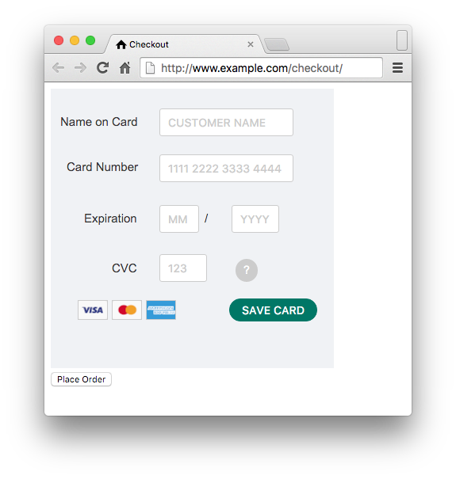

# PCI Requirements

TLDR; The PCI Guidelines only require **SAQ-A** to be filled out when using an iframe to collect payment details, and this is not good enough from a security point of view.

---

When a website accepts payments, it must be PCI Compliant.

This is verified by completing a Self Assessment Questionnaire (SAQ).

There are few different SAQ's you can fill out (see [full listing](https://www.pcisecuritystandards.org/document_library?category=saqs), and the [instructions/guidelines](https://www.pcisecuritystandards.org/documents/SAQ_InstrGuidelines_v3-1.pdf)), but when it comes to websites, the assessment levels include:

1. [**SAQ-A**](https://www.pcisecuritystandards.org/documents/PCI_DSS_v3-1_SAQ_A_rev1-1.pdf): The website has fully outsourced the payment processing to a PCI compliant provider. At no point does the website have access to the payment details (i.e. no storage, processing, or transmission of payment details by the website).

2. [**SAQ-A-EP**](https://www.pcisecuritystandards.org/documents/PCI_DSS_v3-1_SAQ_A-EP_rev1-1.pdf): Same as SAQ-A, but the website can "deliver some elements of the payment page". In summary, this is for "websites that do not [sic] receive cardholder data but which does affect the security of the payment transaction and/or the integrity of the page that accepts the consumer's cardholder data".

3. [**SAQ-D**](https://www.pcisecuritystandards.org/documents/PCI_DSS_v3-1_SAQ_D_Merchant_rev1-1.pdf): For everything else (e.g. the payment details are processed, and maybe stored, by the website).

---

To get an idea of what these assessments require;

1. **SAQ-A**: Fill out a form confirming the website details, that they are allowed to do this quick/simple assessment, who they use for payment processing, and they have verified the provider is PCI compliant. Should take about an hour to complete.

2. **SAQ-A-EP**: Same as SAQ-A, but you also need to answer more questions about the server setup, and include an Approved Scanning Vendor (ASV) report every 3 months. Generally websites should be doing most of the requirements already, so filling out the SAQ form, and getting the ASV scan report, should only take a day or two.

3. **SAQ-D**: The full PCI compliance check, this is outside of the scope of this document, but it's basically a full time job.

As an aside, the additional **SAQ-A-EP** questions are technical, and include things like firewall configuration, server setup (open ports, accounts, installed software, permissions, etc), ensuring the use and correct setup of strong cryptography (e.g. HTTPS), documentation of system setup, coding practices that protect against SQLi/XSS/CSRF, etc... basically, all the good practices when running a website.

---

The problem is that several payment providers are providing iframe/JavaScript solutions, and insist that you only need to fill out **SAQ-A**:

* [WorldPay](https://online.worldpay.com/docs/template-form).
* [BrainTree](https://developers.braintreepayments.com/guides/drop-in/javascript/v2).
* [Stripe](https://stripe.com/docs/checkout/tutorial) ([SAQ note](https://support.stripe.com/questions/what-about-pci-dss-3-1)).

But how can this be the case?

In all 3 cases, the website is delivering the payment page from an **unchecked** server, and its delivering the `

	

	

And it will produce a page that looks something like:

	

Now if someone malicious gets into the **unchecked** server (which is probably running un-patched software), and that JavaScript line was replaced with:

	

That page will probably look something like (as in, exactly the same):

	

Where the form can now submit those details to `evil.example.com`, who in turn will forward the request onto the payment gateway in a classic Man-in-the-middle (MITM) attack (or just simply use a XMLHttpRequest to take a copy of the data).

Now there is a possible problem, in that the MITM might be detected by requests coming from the same IP address. But this can be easily mitigated by using TOR or a BotNet.

As an aside, at least 1 of the developers at WorldPay believes that a MITM cannot edit the Referrer header. I'm not sure why.

---

This is why I do not believe the simple **SAQ-A** is acceptable, and that **SAQ-A-EP** is required for this setup.

Simply because, the website "can impact the security of the payment transaction".

And we must ensure that "each element of the payment page(s) delivered to the consumer's browser originates from either the merchant's website or a PCI DSS compliant service provider(s)"

Any website that does not need to complete **SAQ-A-EP**, should instead send the customer to the payment provider, so the customer can clearly see the payment provider in the address bar, so that they know that the payment is between them and the payment provider, who will be fully PCI compliant (and they have completed **SAQ-D**).
